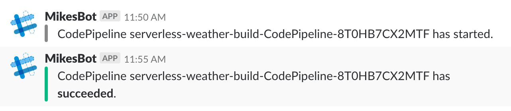

# Code Pipeline Slack Notifier

This small Lambda app will post updates to a Slack channel for pipeline events generated by AWS Code Pipeline.

 

If you have Code Pipelines in multiple accounts / sub-accounts and/or regions then you'll need to deploy this application to each account+region combo that you have your Code Pipelines in.

## Prerequisites

* AWS Account using Code Pipeline. Otherwise there's not much point to this. :)
* [Slack](https://slack.com/) account, and an [**incoming webhook**](https://api.slack.com/incoming-webhooks) URL 
you can use to post to it. This will be something like `https://hooks.slack.com/services/....`
* An AWS user with sufficient privileges to deploy the application from the AWS Serverless Application Repository
* An S3 bucket that you can use as a location of your build artifact. You should have write privileges to this from your AWS user.
* Locally: At least relatively recent version of the AWS CLI, and Node if you are building from source

## Serverless Application Repository App

The easiest way to use this application is via the AWS Serverless Application Repo. You can find it [here](https://serverlessrepo.aws.amazon.com/applications/arn:aws:serverlessrepo:us-east-1:392967531616:applications~CodePipelineSlackNotifier) .

If you want to consume the SAR app as a nested stack (great for putting under source control!) then you can use ``sam init`` to create a template project as follows (This requires the [SAM CLI](https://docs.aws.amazon.com/serverless-application-model/latest/developerguide/serverless-sam-cli-install.html)):

   ```bash
    $ sam init --location gh:symphoniacloud/code-pipeline-slack-notifier
   ```

.. and follow the prompts. Once complete, change into the generated directory and run ``deploy.sh`` to complete, or put the generated project into your typical deployment pipeline flow.

If you can't, or don't want to, use the SAR version, then carry on here...

## Setup

1. Run the following from a terminal, substituting `YOUR_S3_BUCKET` for the S3 bucket described above, and `YOUR-INCOMING-WEBHOOK-URL` for the Slack URL described above:

    ```bash
    $ npm install

    $ npm run dist

    $ aws cloudformation package --template-file sam.yaml --s3-bucket YOUR_S3_BUCKET --output-template-file target/packaged-template.yaml

    $ aws cloudformation deploy --template-file ./target/packaged-template.yaml --stack-name cp-slack-notifier --parameter-overrides SlackUrl=YOUR-INCOMING-WEBHOOK-URL --capabilities CAPABILITY_IAM
    ```

## Testing

If you'd like to test the app, you can configure the following test event in the Lambda console, and test there:

```json
{
  "version": "0",
  "id": "d852b55d-a96a-e396-2e34-107bc39d1e21",
  "detail-type": "CodePipeline Pipeline Execution State Change",
  "source": "aws.codepipeline",
  "account": "123456789012",
  "time": "2018-02-23T16:54:45Z",
  "region": "us-west-2",
  "resources": [
    "arn:aws:codepipeline:us-west-2:123456789012:serverless-weather-build-CodePipeline-ABCDEFGHIJKL"
  ],
  "detail": {
    "pipeline": "serverless-weather-build-CodePipeline-ABCDEFGHIJKL",
    "execution-id": "1620f6b6-6731-4d93-aa3c-123456789012",
    "state": "STARTED",
    "version": 1
  }
}
```

## Possible extensions / modifications

1. To change which types of events you want to be notified about you can specify a filter within the
Cloudwatch Event rule. For instance, to only notify on failed runs of the pipeline, update the `EventPattern` section
of the `CodePipelineEvent` in the `sam.yml` file as follows:

    ```yaml
      EventPattern:
        source:
        - aws.codepipeline
        detail-type:
        - CodePipeline Pipeline Execution State Change
        detail:
          state:
          - FAILED
    ```

1. Similarly, to only notify for certain pipelines you can use the `pipeline` attribute of the `detail` element.
For more details of event filtering, see the documentation at http://docs.aws.amazon.com/codepipeline/latest/userguide/detect-state-changes-cloudwatch-events.html

1. You can also listen for different, more granular, events within CodePipeline. This is also detailed in the link above.

1. You can perform filtering in code, in the Lambda function, but that will mean your Lambda function
is getting triggered more often, which can lead to increased costs.

1. Another nice extension would be different types of message for different kinds of events, or posting to different channels for different pipelines. Either of these are possible by modifying the message POSTed to Slack. See https://api.slack.com/docs/messages for more details

## Teardown

To teardown the notifier delete the stack through the Web Console, or use the incantation below:

```bash
$ aws cloudformation delete-stack --stack-name cp-slack-notifier
```

-----
Copyright 2017, Symphonia LLC
